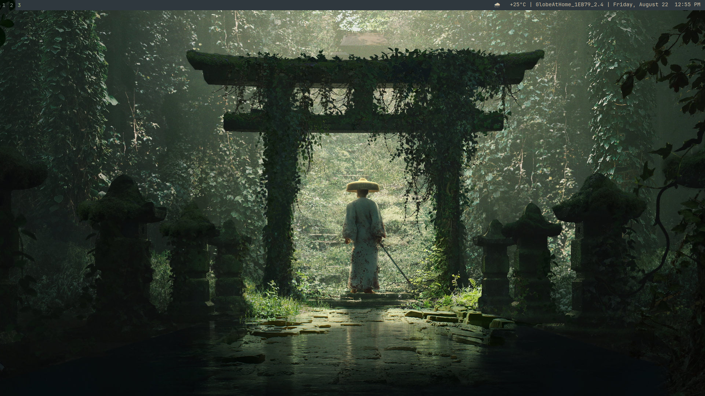

# 🌿 SwayWM Configuration Files
This is my configuration files for a new linux rice using SwayWM.

## 🍚 Rice Details
- OS: EndeavourOS
- Kernel: Linux
- WM: SwayWM
- Bar: Swaybar
- Terminal: Kitty
- Text-editor: VS Code & Vim 
- Browser: Google Chrome
- Theme: Everforest Dark

## ⚡ Features
- Blazingly fast workspace setup
- Fully customized swaybar
- Modern aesthetic featuring Everforest theme.

### 👤 Creator
[Ram Jesler B. Delos Santos](https://www.linkedin.com/in/ramjeslerdelossantos/)